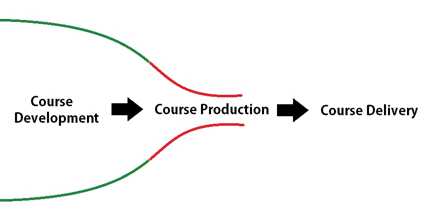

# The Robots are Coming: Our Journey Towards Course Production Automation
`Who we are, Helpdesk split, Bottleneck, Leverage technology, Scalable solution, Ongoing effort`

[Presentation Welcome Slide](presentation-welcome-slide.html)
[Intro robotic music](https://play.google.com/music/listen#/wst/situations/Lwsk3igt53fv4omrdo6pf2dfjgu)

## Welcome (Kyle)
`Who we are`

* We are the Course Production Team in the Learning and Teaching Centre
	* This is where we work
	[Office VR](https://ltctest.bcit.ca/projects/latt/ice-cream-vr/)

* This workshop is meant to be pretty casual
	* We're going for a pseudo panel-style discussion
	* Please stop us and ask questions at any point
	* We should have time at the end for Q & A as well

### Background (Kyle)
`Helpdesk split`

* Our LTC is centralized

> Anyone else in a unit that serves the entire organization?

* In the past, Helpdesk and course production together
	* Project deadlines competed with "urgent" phone or email requests
	* ~ 2 years ago, team was split to
		* allow specialization
		* streamline course production
		* serve our clients better

	* Separated, specialized = no interuptions

## Story (Pain Point) (Felicia)
`Bottleneck`

* The bottom line is we were:
	* stressed, frustrated, confused
	* basically stetched thin
		* We were a bottleneck in the course production process
			 * overwhelming IDC to CP ratio

## Solution (Felicia)
`Leverage technology, scalable solution`

* Wanted to leverage technology to find a better process
	* scalable
	* standardized

* Wanted to pivot to a culture of continuous improvement

## Lessons (Karl)
`Ongoing effort`

* Still facing challenges with adoption / buy-in
* Realize can't do anything without compromise
	* tap into a personal willingness to change / accomodate / improve

* Realize that when someone recognizes a problem or notices an opportunity gap
	* know that their intention isn't to criticize, but to make the whole system better
	
* We're still figuring things out