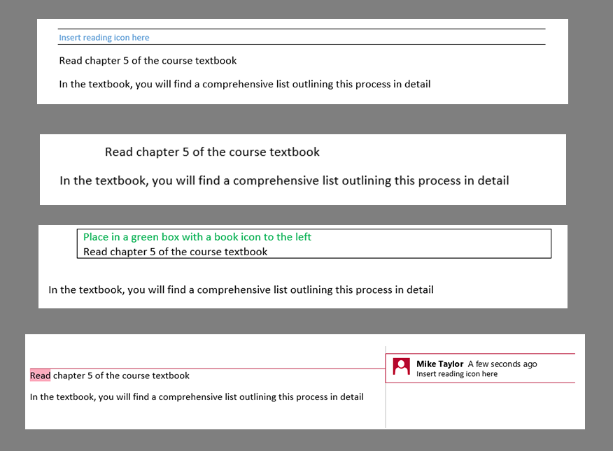
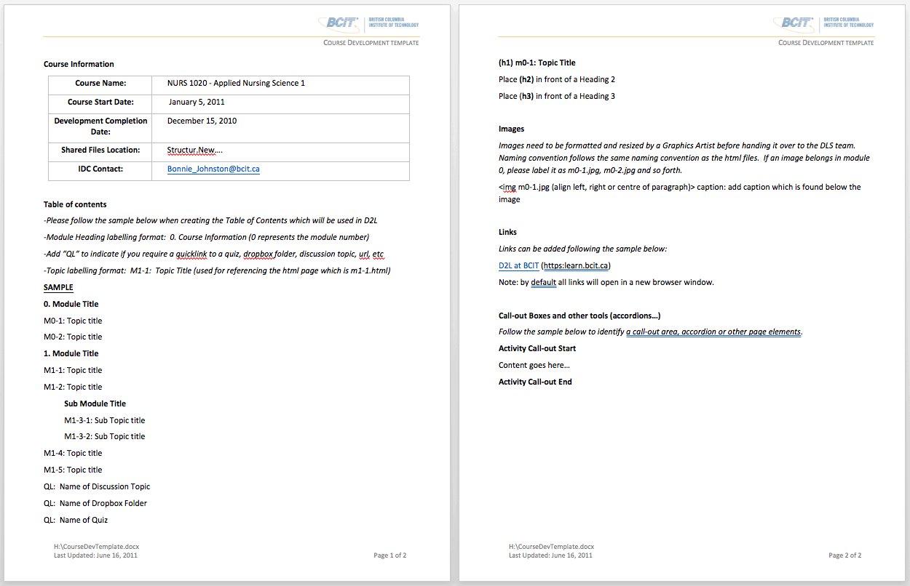
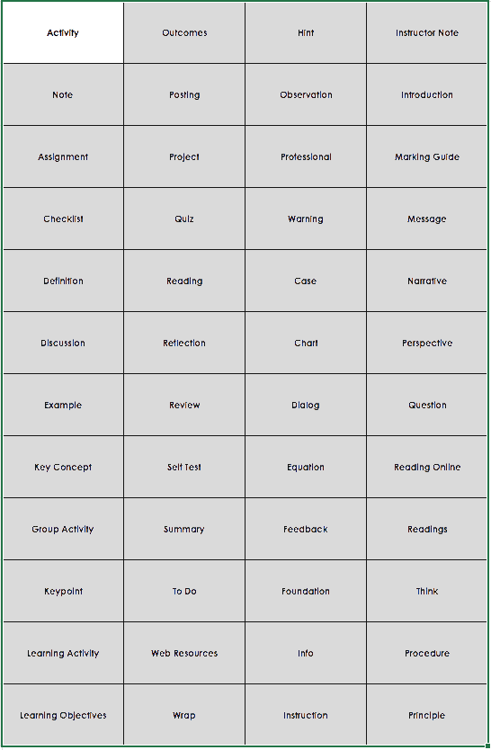
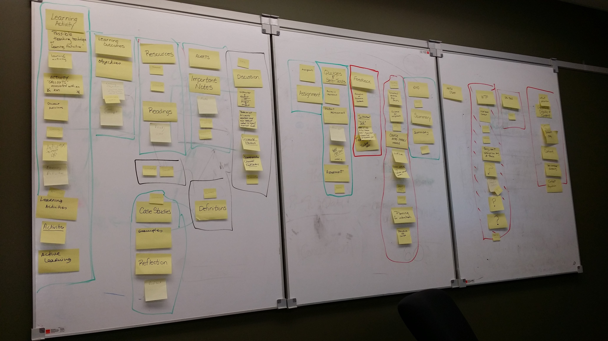
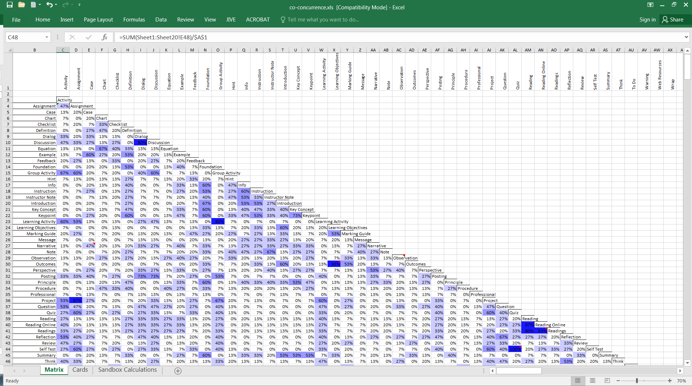
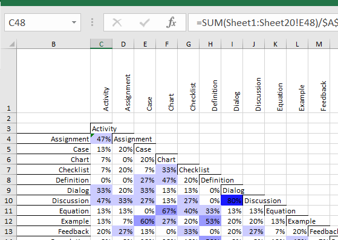

# Finding Consistency
`Inconsistent input, Card Sort + Marker Syntax, Conversion Guide, Standardized Word Templates`

## Story (Pain Point) (Karl)
`Inconsistent input`

* Frustrating to work on
	* It was very difficult to interpret/decipher instructions in various forms
		* color-coded
		* different languague
		* varied from project to project
		* sometimes instructions slipped through into live courses
		
* No consistent use of guide or template
	

* guides and templates were developed but never used as the template for 
	* multiple/rogue templates

* Course development project teams worked independently

## Solution 
### Develop a common language (Mike)
`Card Sort + Marker Syntax`

* We identified all the frequently used terminology in previously developed courses
* We filtered the results used by working with the course developers through a series card sorting exercise
	
	
	

* developed markers for commonly requested content
	

### Common language resource (upstream communication) (Karl)
`Conversion Guide`

* Conversion Guide
	[Conversion Guide Demo](https://ltc.bcit.ca/courseproduction/conversionguide/)

* Reference guide to help developers
	* commonly used language
	* Standardized method of marking up a Word document (#iwantsomething)

### Sample module (Karl)
`Standardized Word Templates`

[Sample Word Module](assets/sample-word-module.docx)

* Styles pane in Word
* Navigation pane in Word
* Search for # symbol, skip through a couple
* Search for #outcomes, skip through a couple
	* Talk about benefits of this syntaxing

* Called it the “conversion guide” was used because the primary function is for content created in Word to be converted in HTML

## Lessons (Felicia)
`Engagement, training`

* Resources aren't enough - training is essential
* Early engagement is not enough
	* Ongoing engagement ensures fair process
	* Change impacts upstream, thus important to have early engagement

* Change can be tough
	* Perceived as controlling
		* Perceived as undercutting creativity

	* Balance between standardization and flexibility