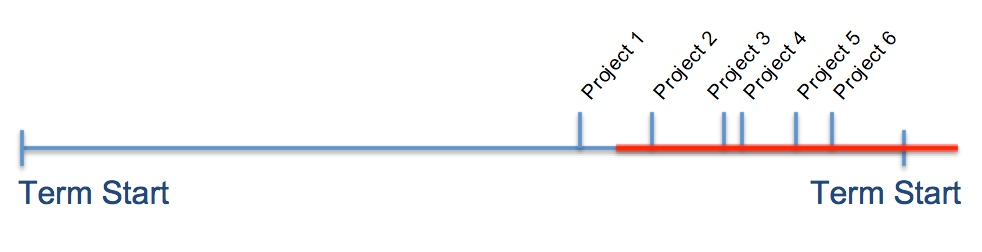
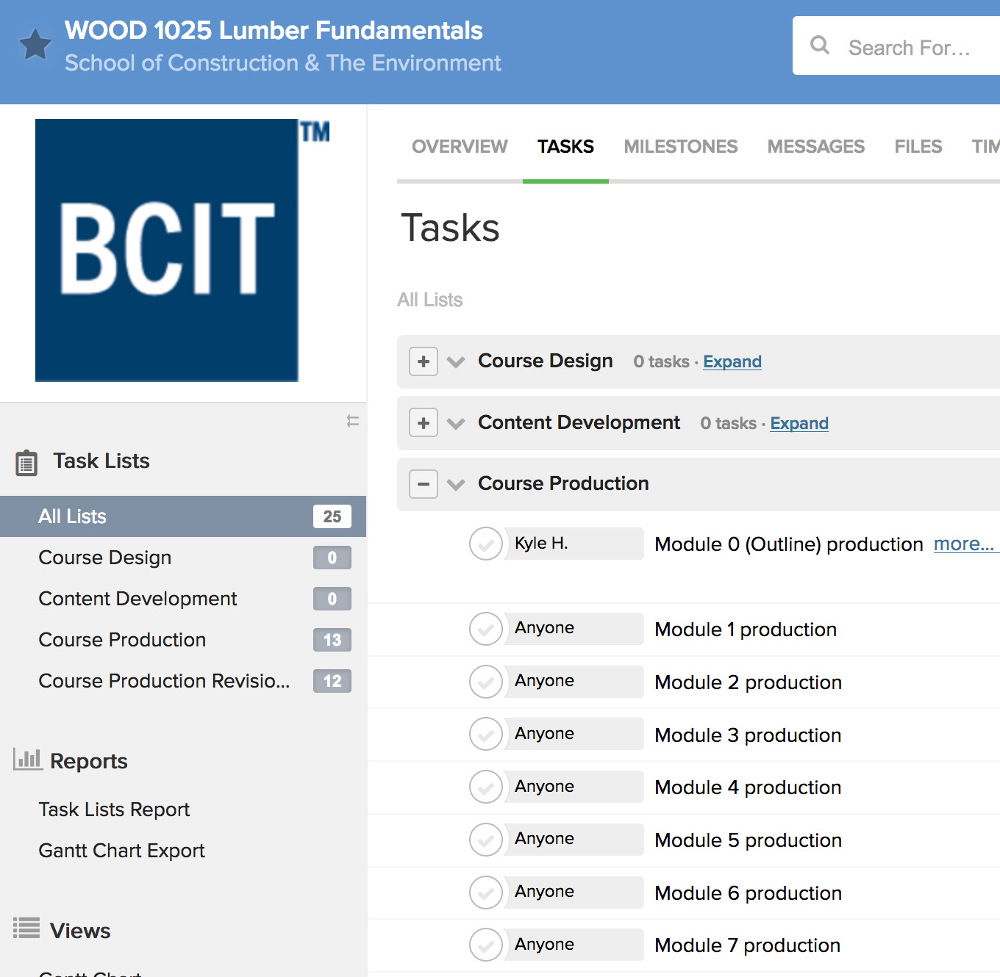

# Teamwork to Address Inconsistency in Content Hand-off, Project Management, and File Sharing
`Scheduling, hand-off, Tasks, Files, Teamwork`

## Story (Pain Point) (Felicia)
`Scheduling, hand-off`

* Difficult to schedule course production work
	* Project plan dates tended to be inaccurate 
		* Guesstimates did not reflect the amount of work for the content that we received
		* No system to effectively scope work
		* Usually pushed-back or delayed

	* Easy to lose track of work
	

* In the past, content was delivered to us in various ways: 
    * USB
    * Shared LTC drive
    * Email
    * DVDs, CDs
    * Scrap paper, post-it notes (not even joking)

* Things would slip through the cracks
* Suddenly surprised by an old project (at an in opportune time)
* Final-Final-final2.docx - not clear which asset to work from
* No real tracked “Tasks” (very informal)
    * By email
    * [knock knock]
        * “Here is module 4… I need it by next week”
        * “Sorry forget about that module 4, it’s the wrong one… here is the real module 4!”
            * Made versioning a problem. Often at times we were looking for the most recent, final document to work off

## Story - Compounded by Crunch Time (Kyle)
`Crunch Time`

* No problem if nothing to do, but needed to manage all of this at the worst of times
	* Right before term start

* Assembling pictures and icons from the GA, videos from the media producer, content from the IDC, interactivities
	* Difficult to put everything together without a common place

# Solution (Kyle)
`Teamwork`

* Department selected a cloud-based project management platform
	* Provide a centralized, file sharing location
		* Teamwork allows for versioning
            * Limits Final Final Final
			* Files are date-stamped so we know which is the most recent version
			* who uploaded it
	        * Word file attached to task is treated as the final document

	* Projects broken down into tasks
	* Tasks can be assigned
	* Files can be attached directly to the task
		* organized into module folders

# Lessons (Karl)
`Resistance, adoption, accomodation`

* Slow adoption
	* comfortable with existing processes
	* too busy to learn Teamwork
    
* We still have to be accommodating
	* Assets not coming in at the same time as Word document
		* Videos coming in after
		* Images not ready yet
		* Transcripts coming in after videos
		* Not just from project manager
		* Still coming in on USB