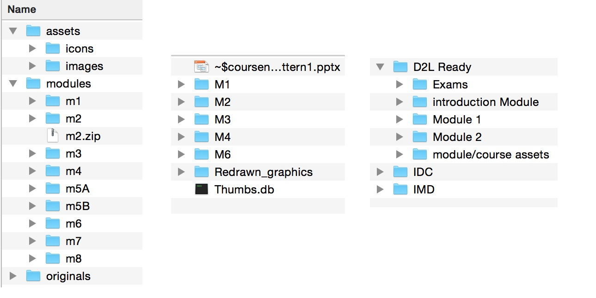

# Location, location, vacation
`Standard process, version control, standard file structure, learning curve`

## Story (Pain Point) (Karl)
`Standard process`

* Inability to easily share work
	* Difficult to hand-over work to a colleague
		* Projects were course-based
		* Individual operating procedures
			* Coding styles varied
			
		* Switching between projects was costly and time-consuming
		* File structure varied significantly across courses
		

	* Difficult to find files
	* Some very unorganized
	* Not maintainable

* Couldn't take vacations during crunch time
	

## Solution (Mike)
`Version control, standard file structure`

* Version Control (File/Project Sharing)
* Standard of File structure
	

* Skeleton
* We all know where to find things
* Multiple people working in parallel on a single course
	* faster
	* less risk of overwriting

## Lessons (Kyle)
`Learning curve`

* Git is a monster sometimes
	
	* Merge conflicts (OMG)
	* Deciding on most appropriate workflow (branching)

* Different training for Auxiliaries (Jorge)
	* Coaching vs This is how we do things here

* Files are now stored in a more clean, consistent, standardized manner