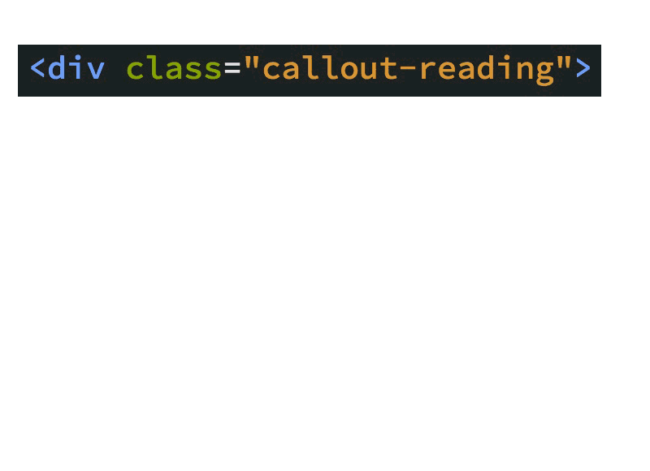
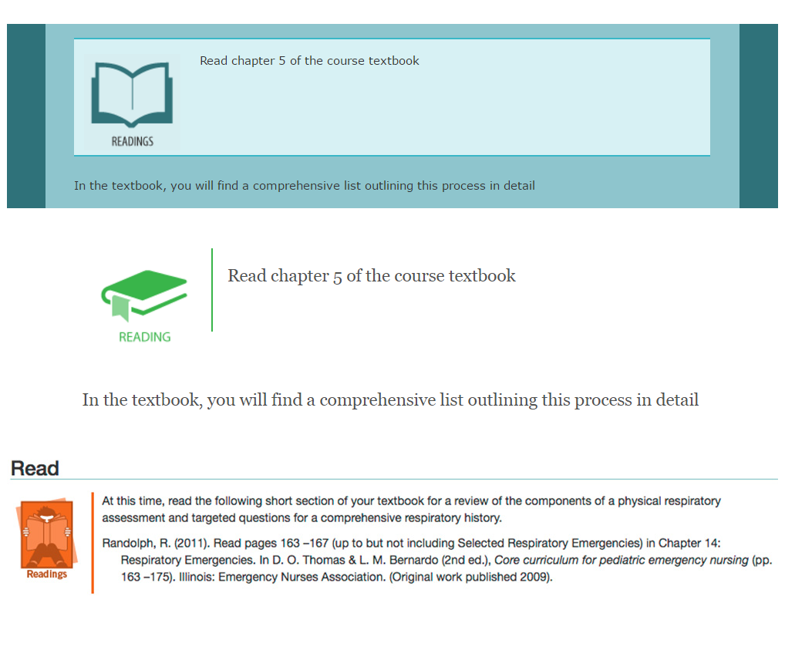

# Standardizing CSS and HTML
`Snowflakes, local CSS, bikeshedding, `

## Story (Pain Point) (Felicia)
`Snowflakes, local CSS, bikeshedding`

* Mainining courses was a nightmare
	* Every course a snowflake
		* No cohesive design between courses (even in the same program)

	* CSS stored inside the course
		* couldn't fix a similar problem across multiple courses

	* naming conventions in the code varied
		* synonnyms
		* upercase, lowercase
		* spaces vs hyphens, underscores

* Unsemantic HTML
	* Using blockquotes to indent
	* Everything in a box was treated the same
	* Cluttered HTML (daunting to look at)
		* CSS was thin and light
		* everything was styled in the HTML

* “bike shedding”
	* Styles decisions based on personal preferences of non-designers
	
	* Everyone had to put their own mark on the course
	* No accessibility
	* Lack of visual design
	* Stuck in the 90s
	* Plain ugly
	* No consultation with Graphic Artists

## Solution
### Sugar Suite (Mike)
`Sugar Suite`

* We built an online course framework that includes HTML, CSS and JS working in concert
	* moved styling from HTML into CSS and JS
		* super clean HTML

* The framework is stored centrally
	* Re-use of code
	* Prevents tampering and breakage
	* Easy to deploy changes
		* Add javascript to existing courses
			* warning that links link to an external resource
			* fixing tables so they can be more easily read
			* fix bugs

	* More intricate work
		* Using sass now
		* Serious tables
		* Responsive design

### Designer-led (Karl)
`Designer-led`

* Collaborated with Graphic Artists
* Loosely aligned with BCIT marketing communications
	* maintained independence
	* West Coast Pallette

* Asking people to focus on content rather than design
	* colours, fonts, icons

* Optimized: 
	* usability and readability of the content
	* accessibility & maintainability of the code

## Lessons (Mike)
`CSS complexity, customization outstanding`

* Moving complexity to the CSS has increased the skills required to maintain it
* Still need a way to handle customization requests
* Coming up with a standard theme can be difficult if you're basing it on institutional branding
	* illusion of change?