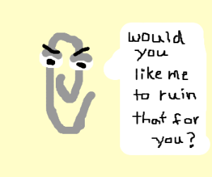

# Word to HTML Conversion
`Copy pasta, Dewordify demo, `

## Story (Pain Point) (Felicia)
`Copy pasta`

* Highly repetitive, yet detail oriented work required under massive time crunches
* Labour intensive
	* ~40% of the job was cleaning up the garbage from MS Word (Microsoft ruins everything)
	
	* ~40% was spent copying and pasting into content into HTML templates
	
	* Only ~20% left for value added activities

## Solution (Mike)
`Dewordify demo`

[Sample Word Module](demo/sample-word-module.docx)
* We've been talking a lot about consistency and whatnot
	* Remember the conversion guide?
		* markers
		* Heading Styles

* Robots
	* In particiular, we designed a program that ingests word documents and poops html
		* Started as a small snippet of javascript running in the browser
		* Later ported to run locally using Node.js
			* It was bumping in the dark the whole way through

		* Spread to colleagues as crunch-time solution

> * How many of you rely on other people to convert this text document into HTML?
> * How long does this usually take?
> * How many of you are actually responsible for converting text content into HTML?
> * How do you approach this?
>	* Copy paste?
>	* Do you use any tools?

* DEMO Time
	* automatically converts the #markers that we developed (the shared language discussed earlier)
	* breaks content into pages based on 'Heading Style 1'
	* _preview.html

* Benefits
	* Faster throughput
	* Higher quality output
	* More time to work on other projects
		* Eg: Creating the conversion guide or Preparing for an ETUG presentation

## Lessons (Felicia)
`CLI scary, revisions`

* Command line tools can be a scary to newcommers
* Revisions after the conversion are not yet streamlined
	* If we could somehow provide access to a previewing tool earlier in the process, we might be able to avoid a lot of downstream work
