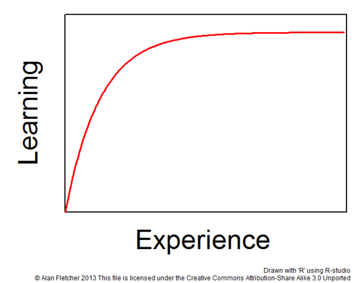
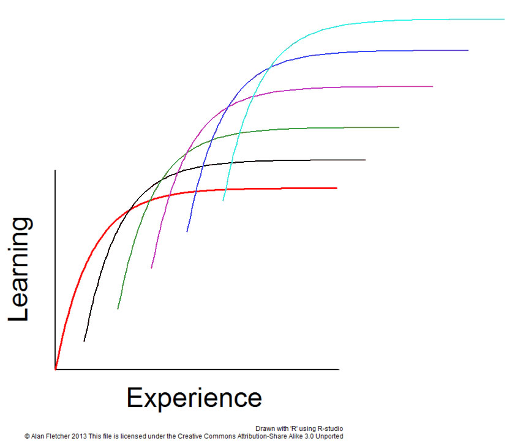
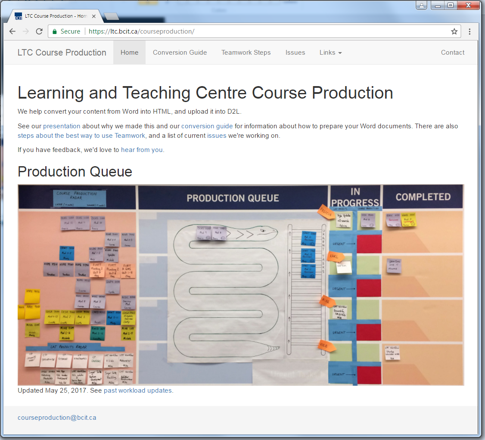

# Summary / Lessons learned
`Lots of change, learning, improvements, more to go, ongoing effort, worth it`

## Recap (Kyle)
`Lots of change, learning, improvements, more to go`

* Lots of change
	* Developed standardized language
	* Implemented centralized file sharing
	* Adopted Teamwork, a cloud-based project management tool
	* Standardized task time estimates
	* Implemented FIFO queue
	* Adopted production board, a Kanban-style visual workflow
	* Established guarantee dates
	* Implemented version control
	* Standardized module structure
	* Standardized HTML, CSS and JS
	* Automated Word->HTML conversion

* Lots of learning
	
	

	* Technology
		* Continual learning and mastering skill sets
		* Keeping on top of technology trends

	* Communication
		* Learning how to communicate using new tech, Lean methodologies
		* Informing each other of the problems we encounter

* Lots of improvements	
	* Increased capacity

Year | Project Count
-----|--------------
2012 | 17
2013 | 16
2014 | 17
2015 | 13
2016 | 30 (53% increase)

* Increased efficiency
	* Average module production time reduced from ~7.5hrs to 3.7hrs (51% decrease)

* Lots more to go
	* Interactivities
		* We don’t have a standard method for requesting content for things like drag-n-drops, hotspots, image galleries, etc...

	* Onboarding
		* Everyone's new to the process and we haven’t developed a training system

* Digitized Production board
	* Real-time offsite status reports
	

* Course Production Website
	* A centralized place to access all the things
	

## Lessons (Karl)
`Ongoing effort, worth it`

* Adoption
	* Ongoing effort / challenge
	* changings peoples mindset

* It's been worth it
	* less frustration
	* more consistency!
	* more clarity
		* standard procedures

	* fewer errors
	* more sharing and collaboration
	* more time to invest in development