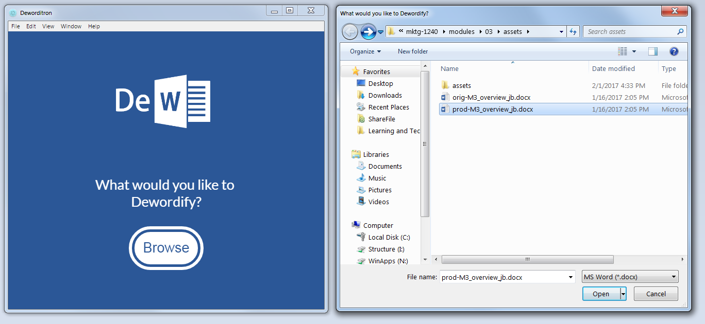
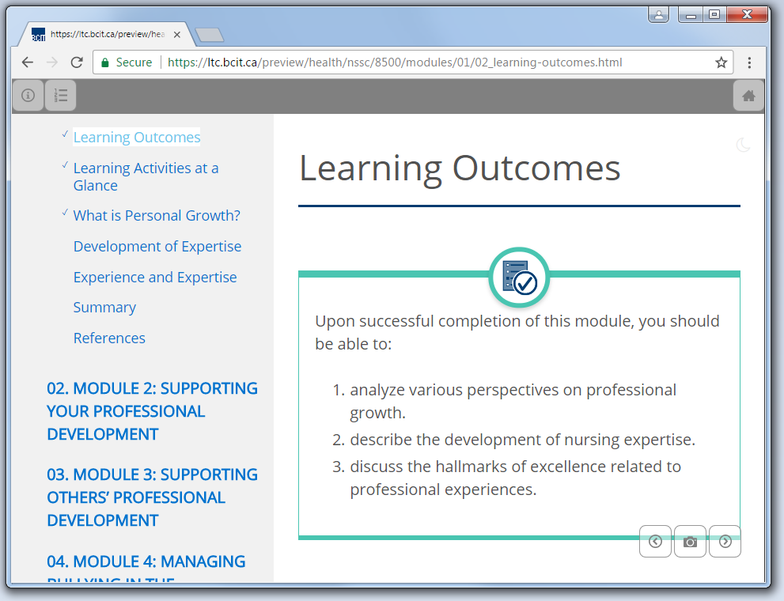
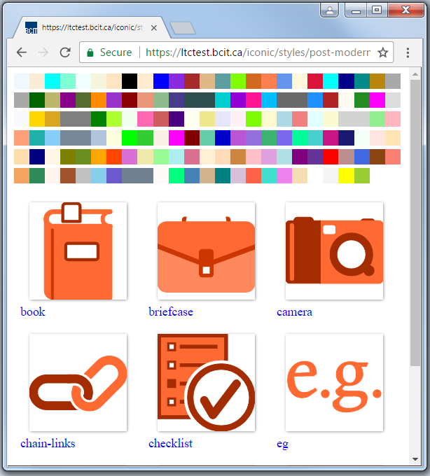
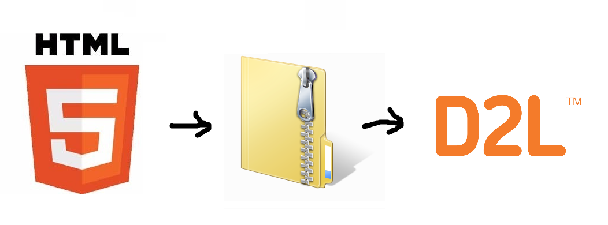
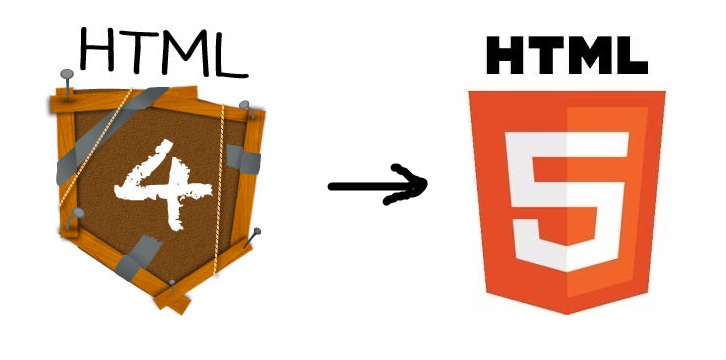
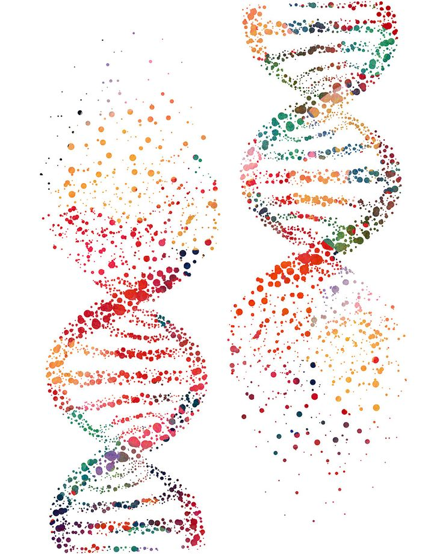
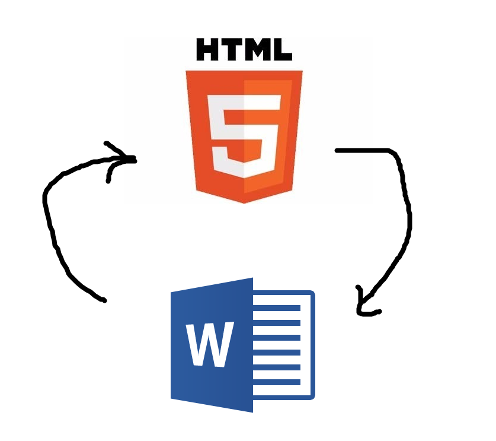

# Looking to the Future
`What we're working on`

## Opportunities (Mike)
`What we're working on`

* Deworditron
	* Cross-platform desktop application for running dewordify with a GUI
	

* Web Based Dewordify
	* Empowering developers to produce their own course with an intuitive GUI
	* Previewer
		* Opportunities such as aggregating similar structures for comparison
		

* Improving our CSS/JS framework
	* More themes
	* More Interactions 
	* Easier customization
	

* [Iconic Server](http://ltctest.bcit.ca/iconic/styles/post-modern)
	* In order to deal with themes, we need to re-color icons.  Iconic is an SVG server that can automatically recolour icons based on the URL path
	

* Importerer
	* Packaging up the outputs of Dewordify into an importable SCORM package
	

* Makeoverer
	* Refreshing old courses with our new look
	

* Restructurer
	* Taming the chaos of older course folder structure
	

* H2Wo
	* Full circle. Creating word documents from HTML pages for re-development
	