# The Robots are Coming: Our Journey Towards Course Production Automation

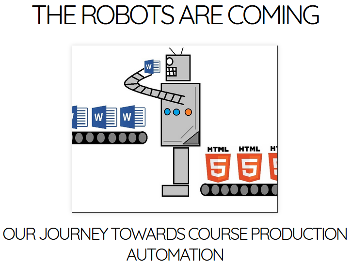

[Intro robotic music](https://play.google.com/music/listen#/wst/situations/Lwsk3igt53fv4omrdo6pf2dfjgu)

---

## 0 - Background (Kyle)
`Who we are`

See [kyle-intro-script.md](kyle-intro-script.md)

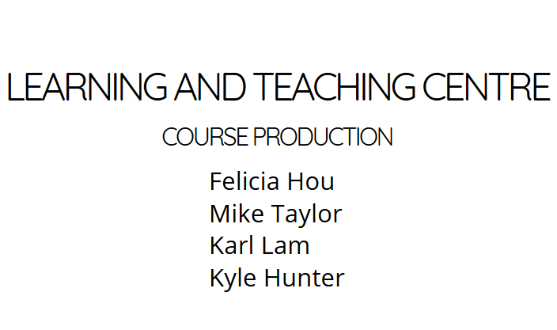

* We are the Course Production Team in the Learning and Teaching Centre

* Panel style: please stop us and ask questions at any point (hands-up)

* We take content from a variety of people in Word format, process it, and build courses

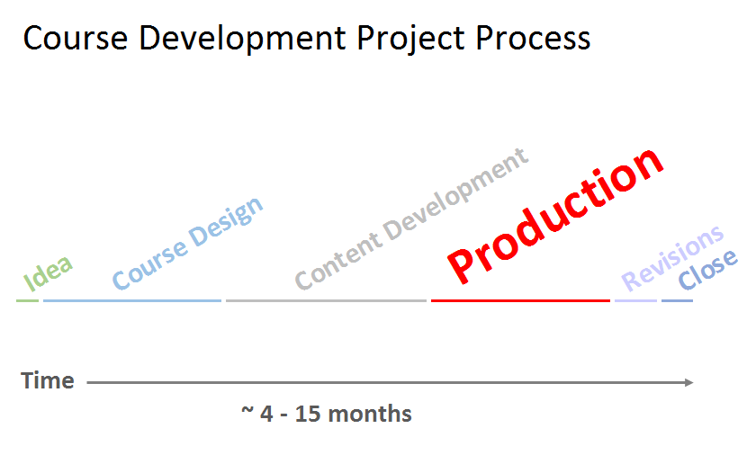

* This timeline shows our role in the course production project process

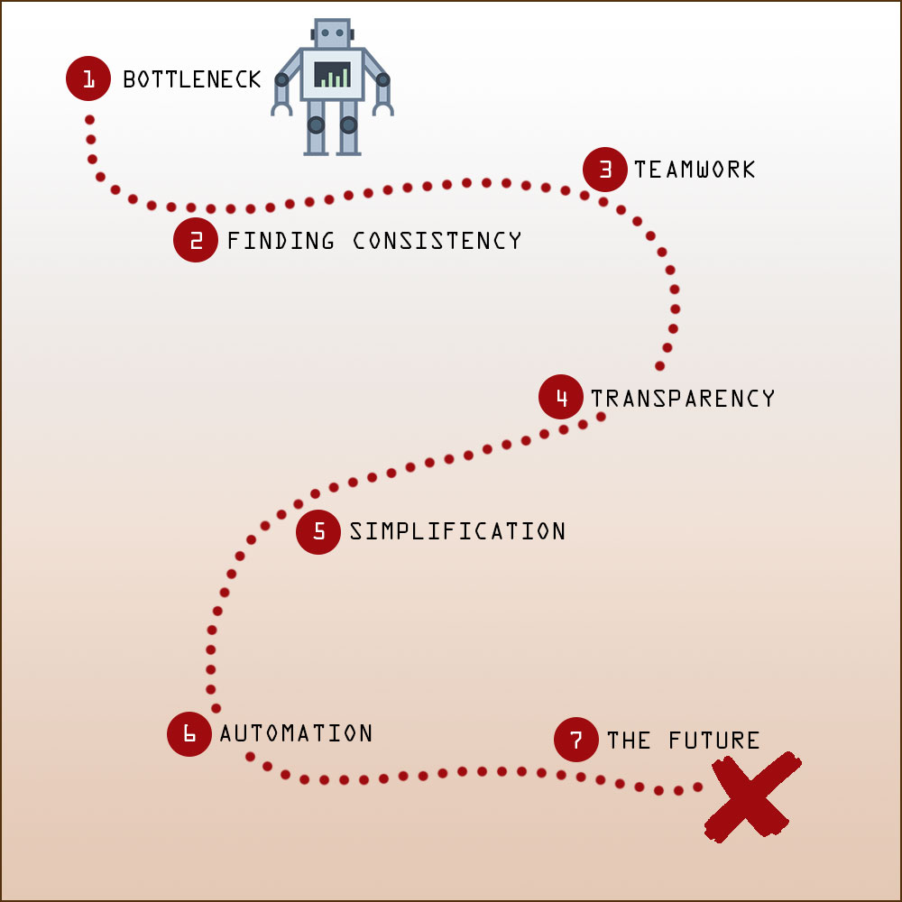

* Today, we're showing our journey to improve and automate the course production process

---

# 1 - Bottleneck (Kyle)

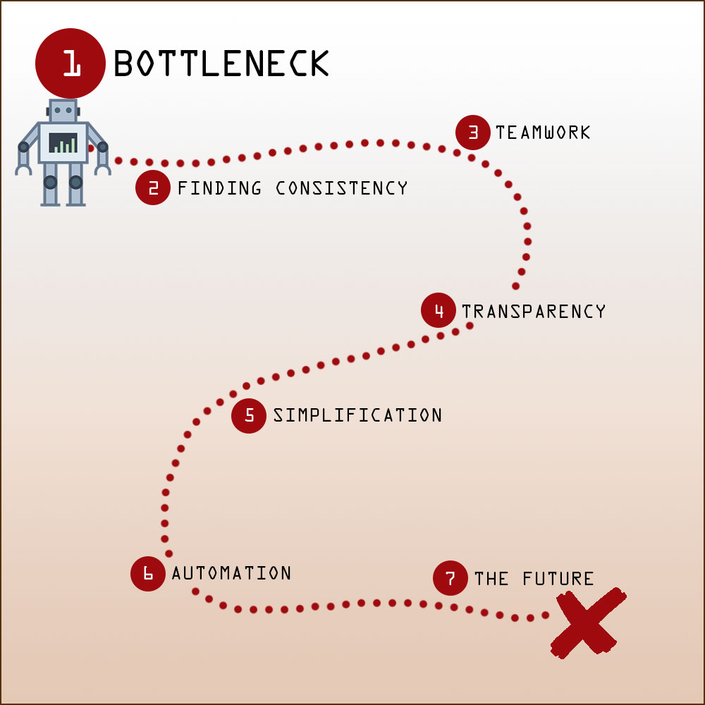

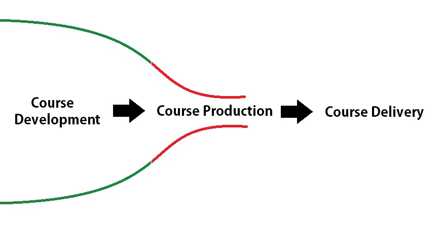

* overwhelming Instructional Designers to Course Producer ratio
	* We were a bottleneck in the course production process

* Wanted to leverage technology to find a better process
	* scalable
	* standardized

* Wanted to pivot to a culture of continuous improvement

---

# 2 - Finding Consistency (Karl)
`Inconsistent input`

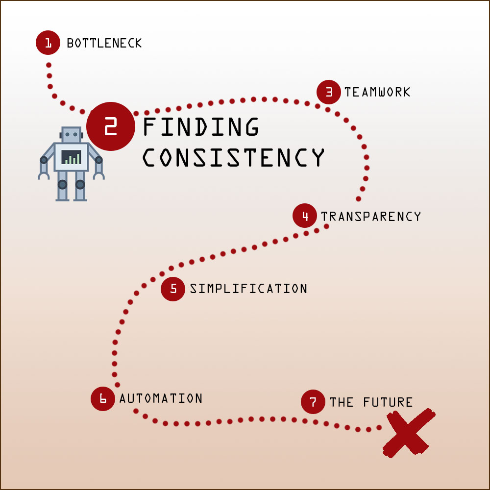

**Click through 3 examples**

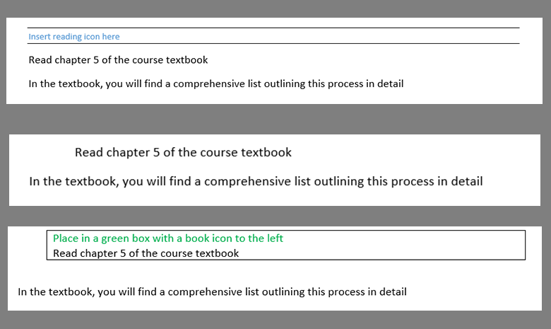

* Instructions were difficult to decipher

---

# 2 - Finding Consistency - Solution
## Develop a common language (Mike)

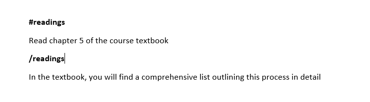

* Started by encouraging the use of #markers
	* Easy to spot
	* Difficult to miss
	* Simple
		* Easy to remember
		* Minimal keystrokes
	* Clearly indicates the start/end of content

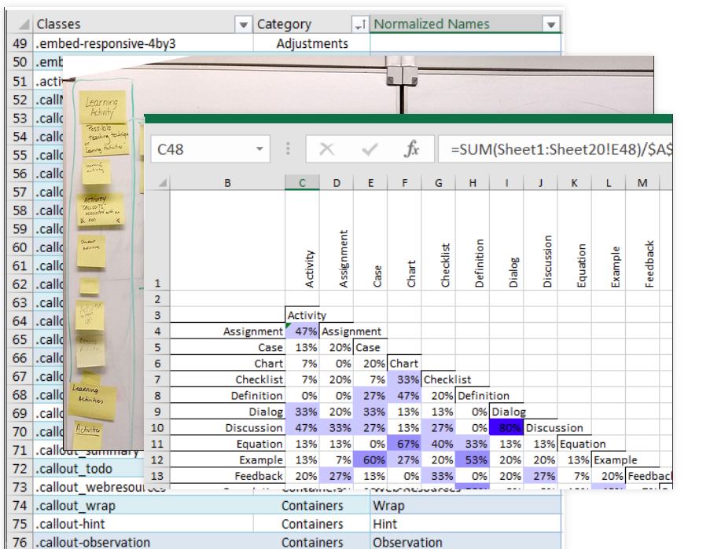

* Next we:
	1. Compiled a list instructional language found in older courses
	2. Asked various members of the LTC to perform a card-sorting excercise
	3. Eliminated duplicates and produced a core set of commonly used "learning blocks"

## Conversion Guide (Karl)

* Provide a guide for how to mark documents so we understand it
* Results of card-sort ---> menu

[Conversion Guide Demo](https://ltc.bcit.ca/courseproduction/conversionguide/)

* Open menu of User Interface patterns
* Click on Readings
	* preview
	* Word
	* html

---

# 3 - Teamwork (Felicia)
`inconsistent hand-off`

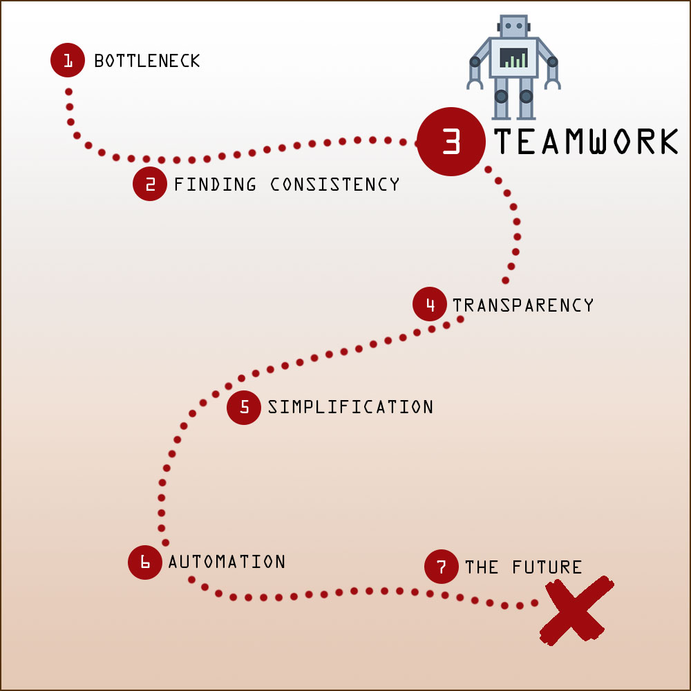

* Communication was very informal
    * By email
    * [knock knock]
        * “Sorry forget about that module 4, it’s the wrong one… here is the real module 4!”

* We're getting stuff from all over the place
	 * Different people (instructional designers, video producers)
    * USB
    * Shared LTC drive
    * Email
    * DVDs, CDs
    * Scrap paper, post-it notes (not even joking)
	 
> Which of these would you work on?

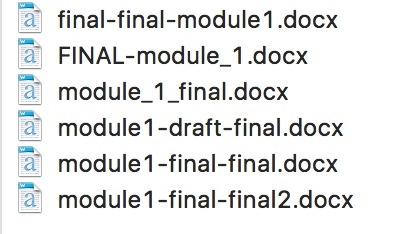

* Final-Final-final2.docx - not clear which asset to work from

* Compounded by Crunch Time

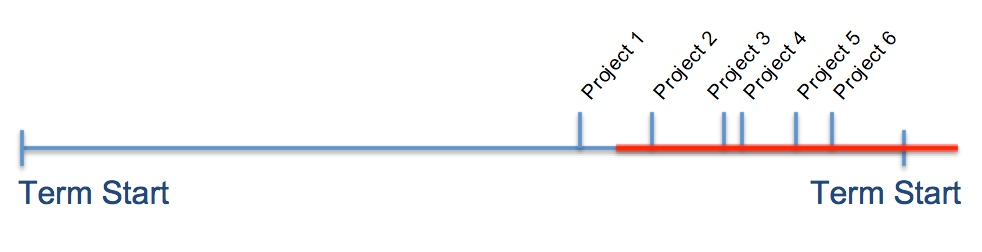

* Easy to lose track of work

---

# 3 - Teamwork - Solution (Karl)

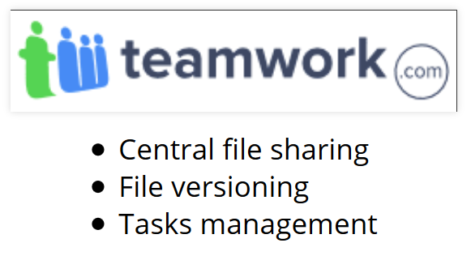
	
* Cloud-based project management platform
	* Central file sharing
	* File versioning
	* Tasks management

---

# 4 - Transparency (Felicia)

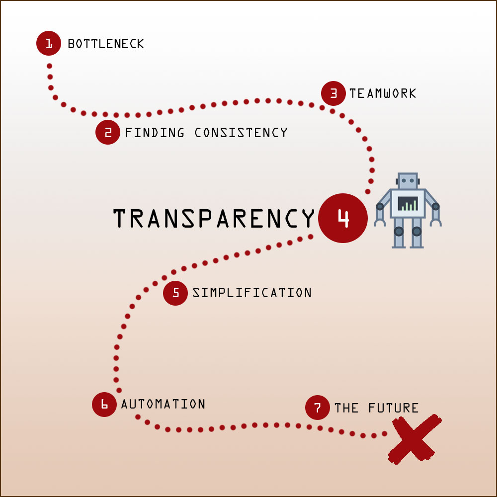

> How do you scope the production time for online courses?
> Are you able to guess how long it will take?

* Course developers didn't see the content until it needed to be produced

* We didn't estimate delivery times, it was assumed to be 1 module per day
	* Really big vs really small modules
	* Scoping difficult

* Difficult to schedule course production work
	* multiple projects on the go

* Untransparent work prioritization
	* Squeaky wheel - the loudest gets their stuff done first
	* inconsistent method of deciding who's work gets done for competing deadlines

* individual course producers bore the brunt of people's frustration

# 4 - Transparency - Solution (Kyle)
`Estimation, FIFO, production board`

* Broke monolith course projects into more granular tasks (modules vs. courses)
	* actual content vs assumed content
	* Estimations calculated with more accuracy
	
[Calculator demo](https://ltc.bcit.ca/startup)
	
* inform / defend how long it takes to complete a task

[Production Board slider](https://ltc.bcit.ca/courseproduction/queue/scripts/index.php)

* leave on first slide
	* slide to Brian H. (management approval)
	* slide to end for iterations
	
* First-in-first-out queue
	* Put up a Kanban-style production board
		* public location
		* LEAN principles
		
	* urgent tasks require management approval
	* intent is to communicate
		* transparent workload & capacity
		* task's current place in line

---

# 5 - Simplification (Felicia)
`inconsistencies in design, code and workloads`

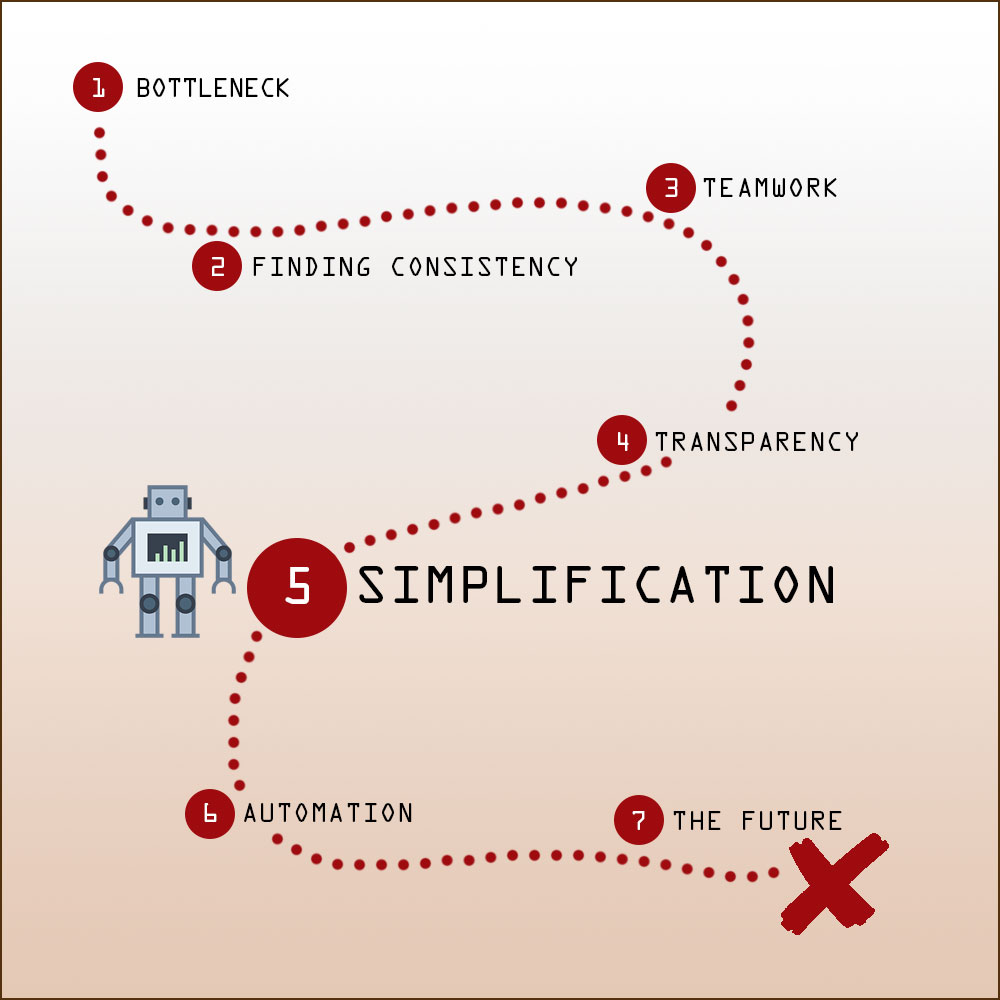

> Anyone know what bike shedding is?

* Design inconsistencies - "bike shedding"
	* Too much time spent on trivial details instead of what's actually important
	* Style decisions based on preferences of non-designers
		* 
		* 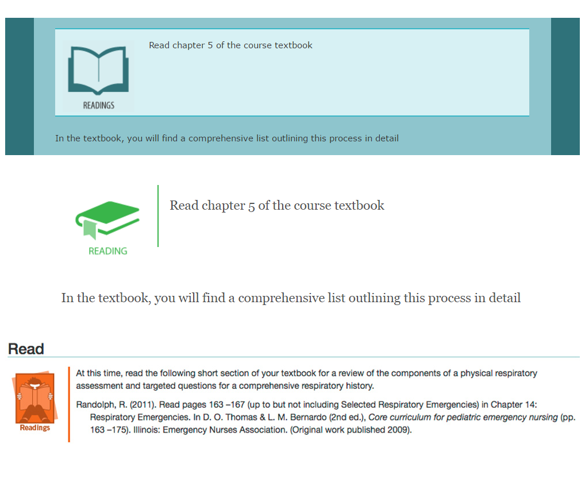
		* Every course a slightly different
		
	* No accessibility
	* Lack of visual design
	* No consultation with Graphic Artists
	* No cohesive design between courses (even within the same program)

* Code and structure - different working styles between course producers
	* file structures
	* 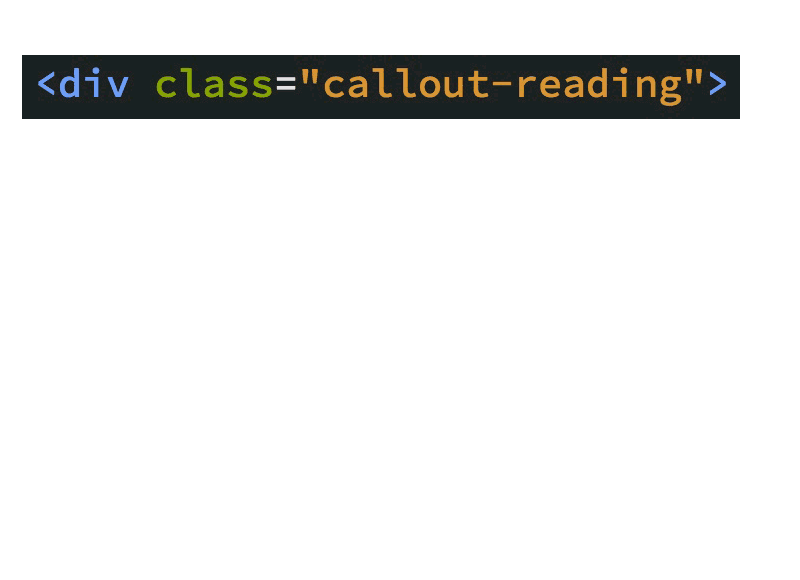
	* naming conventions in the code varied
		* synonyms
		* upercase, lowercase
		* spaces vs hyphens, underscores
		* no shared language

* Workload distribution
	* Therefore, it was difficult to hand-off work to a colleague
		* Trying to work off someone else's CSS was like Peter Griffin

	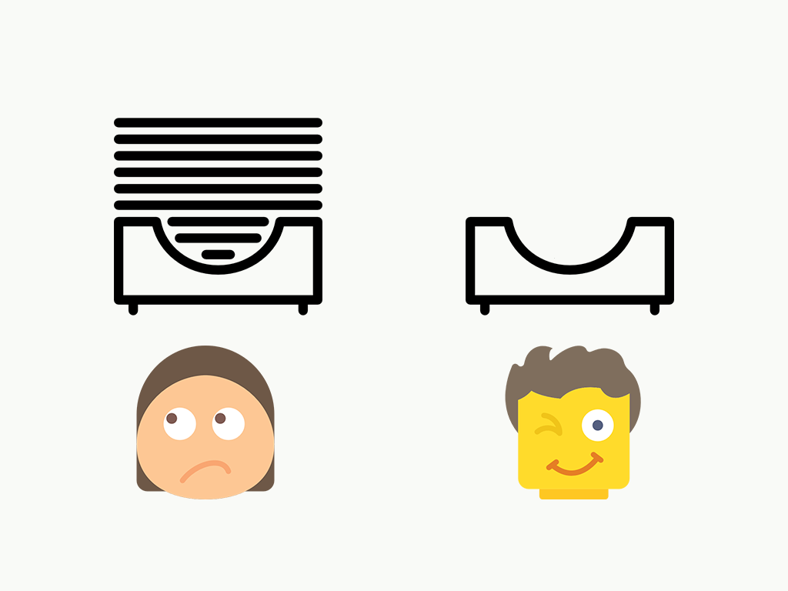

	* Uneven distribution of work
		* no vacations during crunch time (Working over Christmas for a project due by January)

---

# 5 - Simplification - Solution

## Designer-led visual design (Karl)

* Addressing bikeshedding 
* Asking people to focus on content rather than design
	* colours, fonts, icons

[Style Guide](http://ltc.bcit.ca/projects/lat/styleguide_v1/html/bcit.html)

* Collaborated with Graphic Artists and BCIT marketing
	* Optimized
		* usability and readability of the content
		* accessibility & maintainability of the code

## Sugar Suite (Mike)

* Custom CSS/Javascript Framework called Sugar Suite
	* Incorporates shared language
	* Moved complexity
		* super clean HTML
		* Leverages Sass and JS
	* Centrally managed
		* simply point html at a URL
		* Deploy updates and enhancements

## Workload Distribution (Mike)

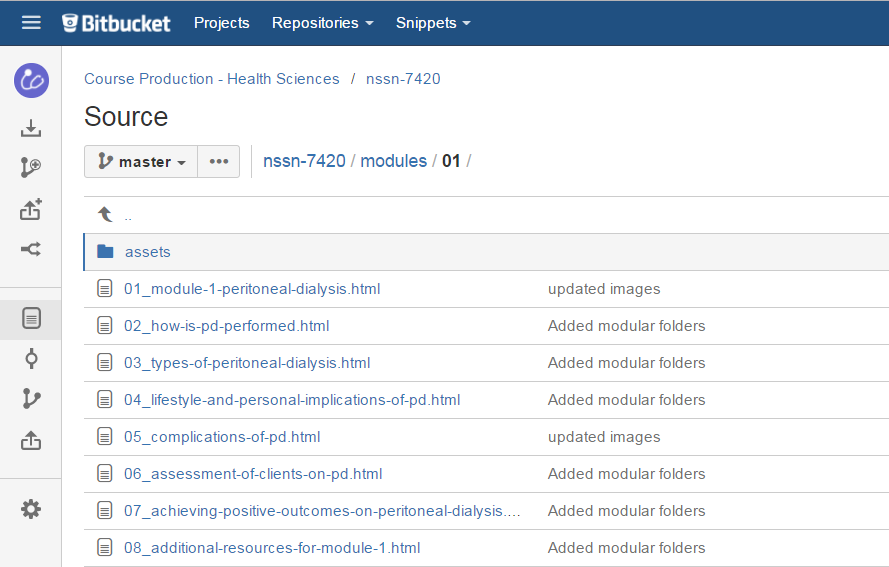

* Standardized Storage:
	* Standard File structure (skeleton)
	* Version Control System (git)

* Result:
	* Because: 
		* Simplified code
		* we all know where to find things
	* We can: 
		* Instantly switch courses
		* Work in parallel

---

# 6 - Word to HTML (Felicia)
`Copy pasta, Dewordify demo`

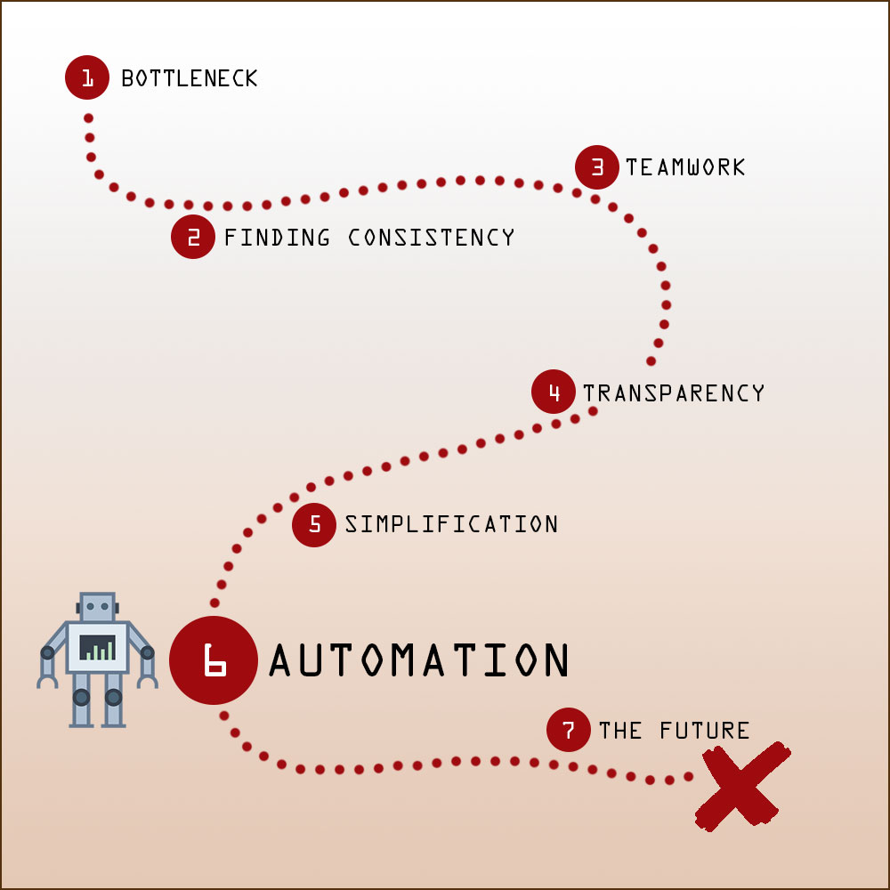

* Highly repetitive, yet detail oriented work required under massive time crunches
* Labour intensive
	* ~40% of the job was cleaning up the garbage from MS Word (Microsoft ruins everything)
	

* ~40% was spent copying and pasting into content into HTML templates
	* Only ~20% left for value added activities

# 6 - Word to HTML - Solution (Mike)
`Dewordify demo`

[Sample Word Module](assets/sample-word-module.docx)

> Ask: How long would this take to convert to HTML?

* Live example:
	* create new page
	* create #reading using the [Conversion Guide](https://ltc.bcit.ca/courseproduction/conversionguide)
	* Ask audience for a suggestion

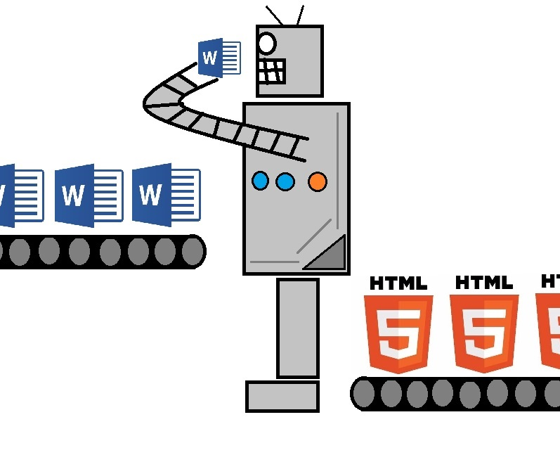
	
* Introduce Dewordify
	* Ingests word documents
	* "Outputs" HTML
	* Custom built from the ground up
		* Written in Javascript (ask me why)
		* Incorporates our shared language
		* Uses our folder structure

* DEMO Time
	* Show the page we added
	* Notice the clean HTML
	* Show images in assets folder

* Benefits
	* Faster throughput

---

# Recap (Kyle)
`Lots of change, learning, improvements, more to go`

* Lots of change
	* Shared language
	* Centralized file sharing
	* Adopted Teamwork, a cloud-based project management tool
	* Standardized task time estimates
	* FIFO queue
	* Adopted production board, a Kanban-style visual workflow
	* Implemented version control
	* Standardized module structure
	* Standardized HTML, CSS and JS
	* Automated Word->HTML conversion

* Lots of learning
	* Engagement, training, change is tough, accommodation, forecasting, revisions

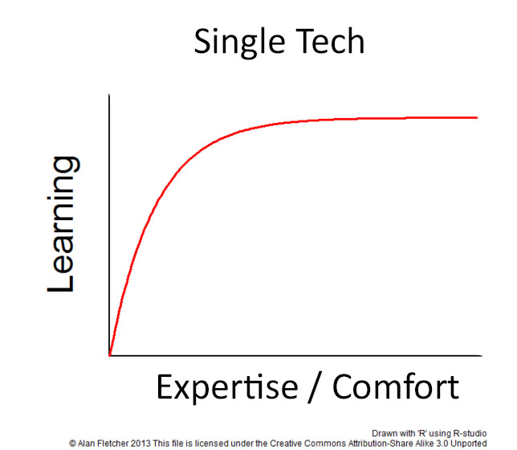

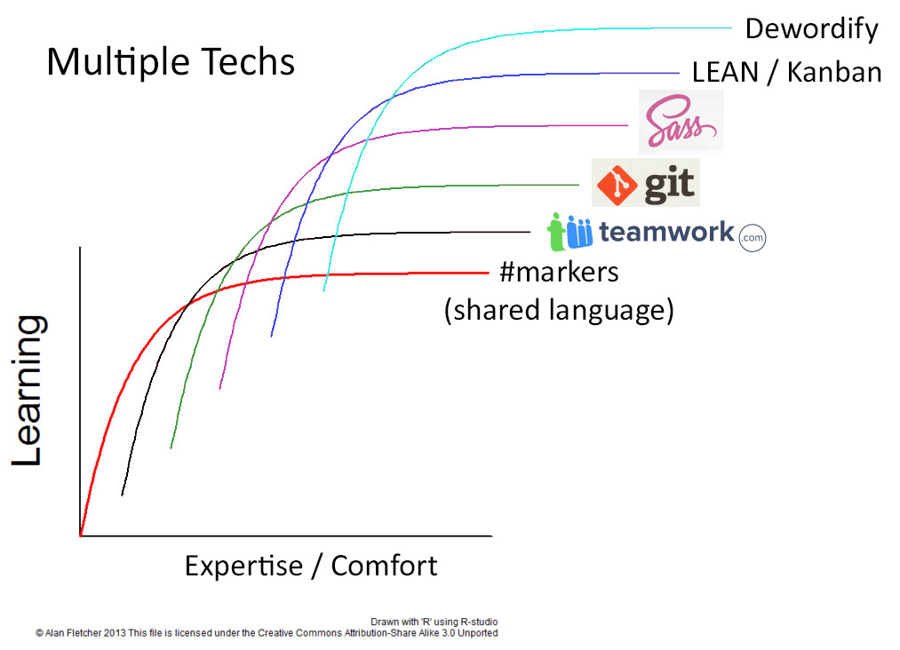

* Lots of improvements
	* 53% increase in # of projects + other stuff
	* 51% decrease in amount of time per module

* Lots more to go
	* Interactivities like drag-n-drops, hotspots
	* Revisions

---

# 7 - The Future (Mike)
`What we're working on`

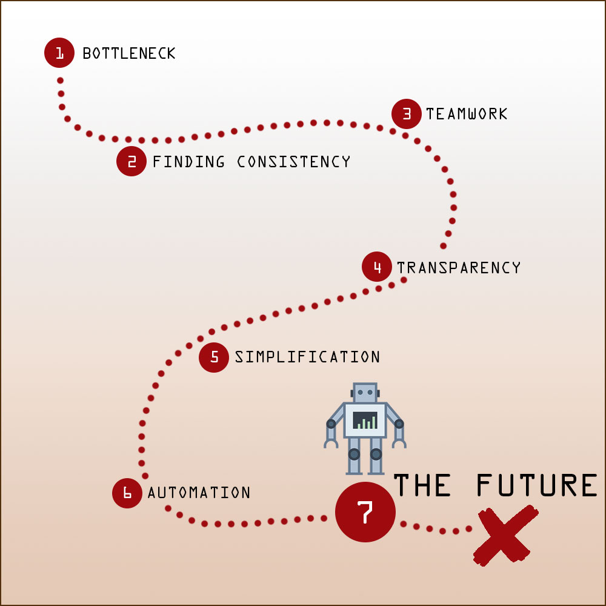

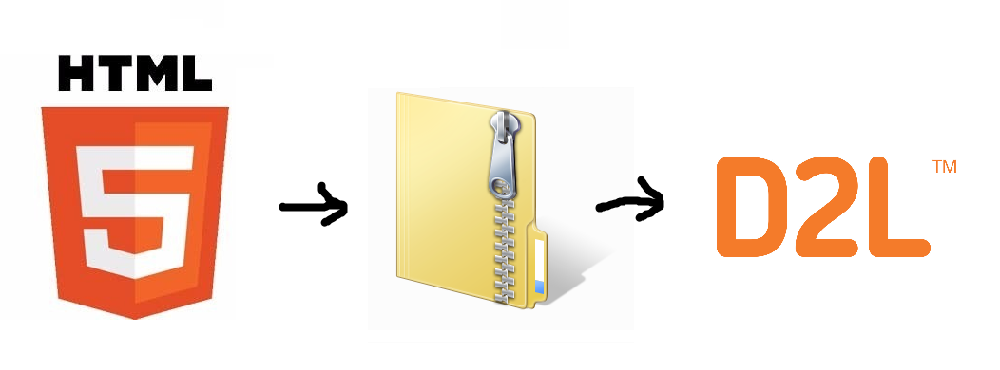

* Importerer
	* Packaging up the outputs of Dewordify into an importable SCORM package

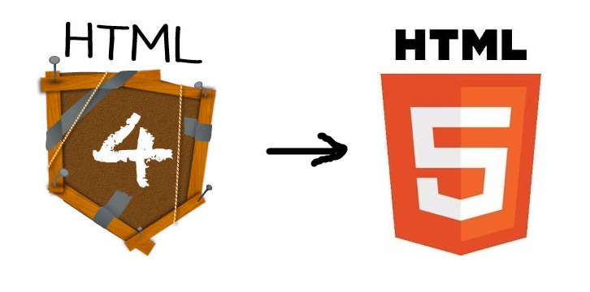

* Makeoverer + Restructurer
	* Refreshing old courses with our new look and our prefered course structure

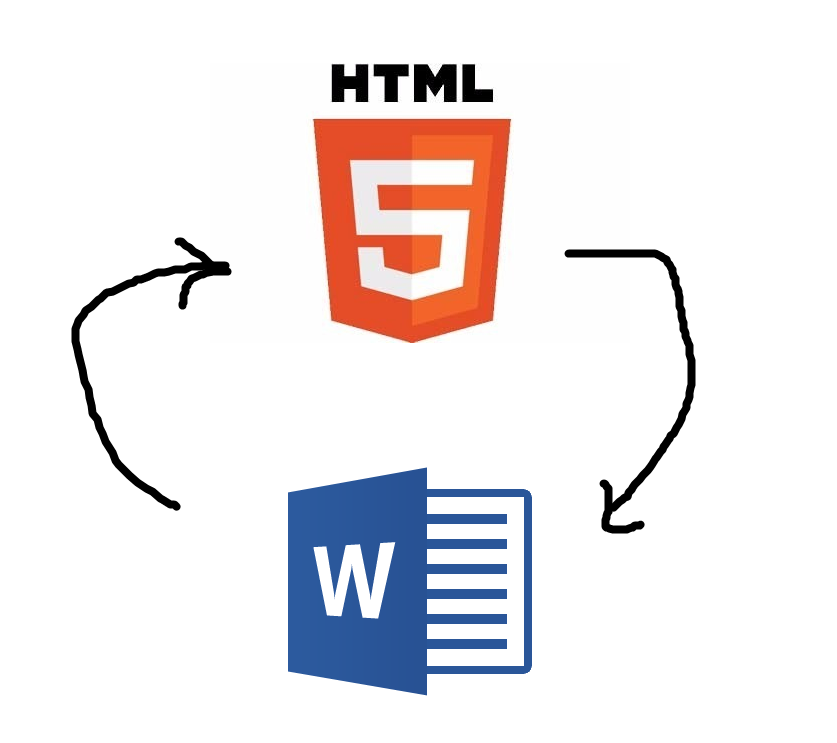

* H2Wo
	* Full circle. Creating word documents from HTML pages for re-development

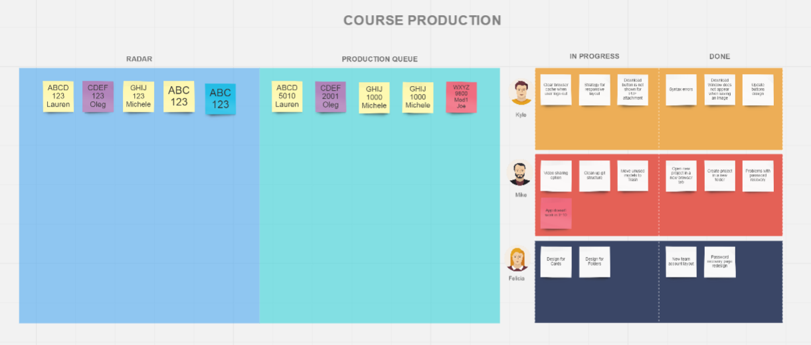

* Digitized Production board
	* Real-time offsite status reports

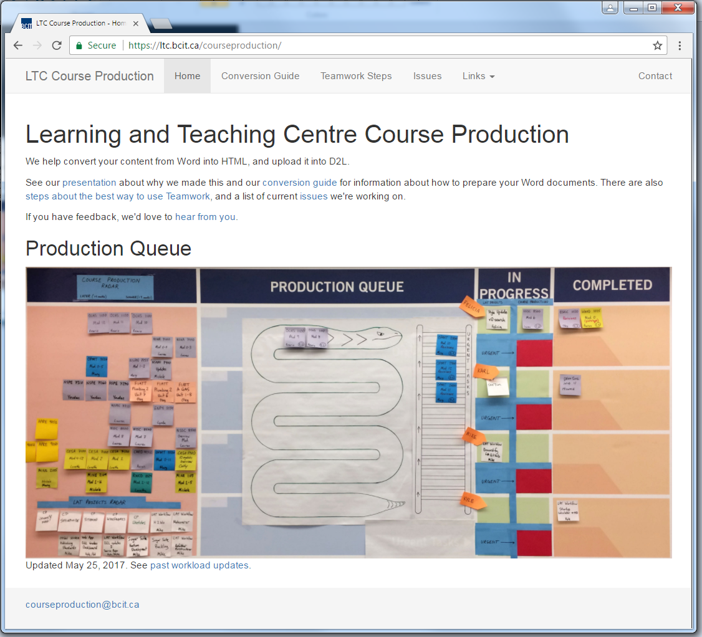

* Course Production Website
	* A centralized place to access all the things
	[Course Production Site](https://ltc.bcit.ca/courseproduction/)

* Improving our CSS/JS framework
	* More themes
	* More Interactions 
	* Easier customization

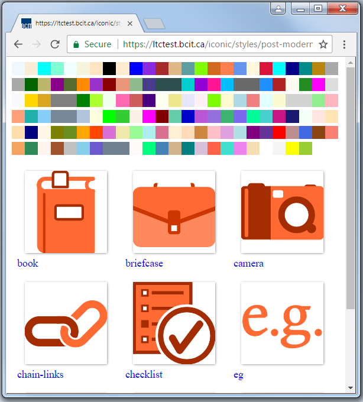

* [Iconic Server](http://ltctest.bcit.ca/iconic/styles/post-modern)
	* In order to deal with themes, we need to re-color icons.  Iconic is an SVG server that can automatically recolour icons based on the URL path

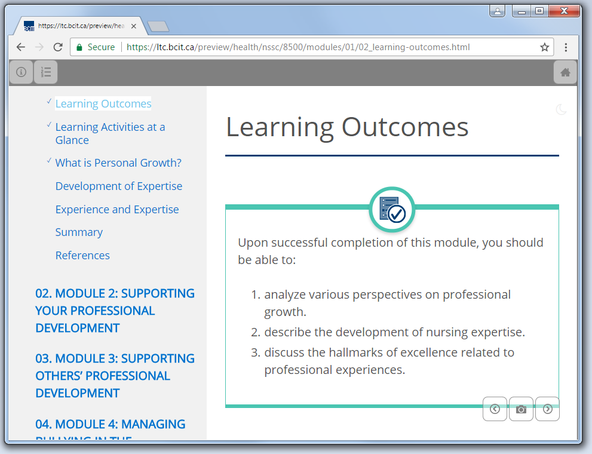

* Web Based Dewordify
	* Empowering developers to produce their own course with an intuitive GUI
	* Previewer
		* Opportunities such as aggregating similar structures for comparison

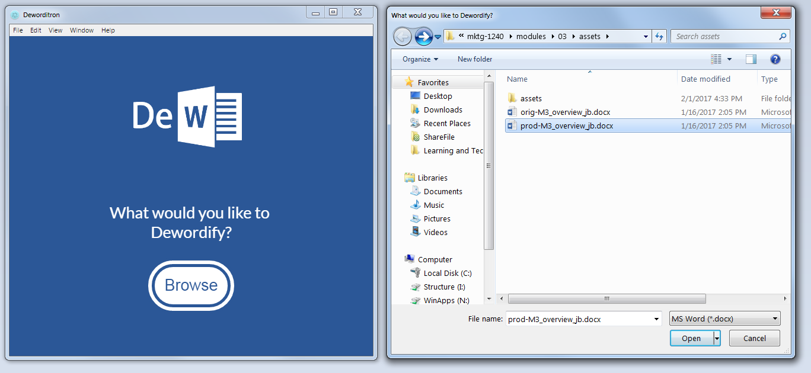

* Deworditron
	* Cross-platform desktop application for running dewordify with a GUI

---

# `Ctl-C` (Kyle)
`Let's collaborate, links, contact`

## Getting started

* [Dewordify on GitHub](https://github.com/BCIT-LTC/dewordify)
* [Conversion Guide](https://ltc.bcit.ca/courseproduction/conversionguide/pages/home.html)

## Contact Us
* [courseproduction@bcit.ca](mailto: courseproduction@bcit.ca)

## Questions?

---
---
---

## Lessons
* Adoptions
	* Ongoing effort / challenge
	* changings peoples mindset
	* Early engagement is not enough - Continous Engagement
		* Fair process
		* Less guesswork
		* Better product
	* Resources aren't enough - training is essential
		* Resources != training
		* Resources support training
	* When change impacts upstream, percieved as:
		* "who are you to tell us what to do"
		* unecessary
		* unwanted
		* unfair
		* controlling
		* undercutting creativity
	* Willingness
		* comfortable with existing processes
		* too busy/low priority
	* Accommodation can bridge the gap
		* Show, coach, remind
		* Be gentle
		* Anticipate blow-back

* Balance between standardization and flexibility
	* Standardizing too soon kills flexibility
		* hard to change later
		* loss of organic learning
	* Impacts on time and quality
		* if flexibility takes longer and produces an inferior product --> standardize

* Estimation
	* Easy to estimate task duration
	* Difficult to estimate task completion
	* Queue jumpers
		* More revisions
			* Would be quicker to do it right the first time
	* Revisions process has not been streamlined
		* Can be very time consuming
		* Difficult to track down/interpret changes
		* Mitigation?
			* Previewer application
			* Lower the priority (After snake empty)
				* Management approval for urgent
			* Empower developers to perform their own revisions
	* Assets not coming in at the same time as Word document
		* Videos coming in after
		* Images not ready yet
		* Transcripts coming in after videos
		* Not just from project manager
		* Still coming in on USB
	* Need for forecasting solution
		* Suddenly surprised by unanticipated work
			* It's hard to turn away people in a panic
		* People try to slip past management approval
	
* Different training for Auxiliaries (Jorge)
	* Command line tools can be a scary to newcommers
	* Less coaching
	* More "Do it this way"
		* Which happens to be really easy once you have the tools
	* Git is a monster sometimes
		* Basic understanding
		* Getting comfortable
		* Fixing problems
			* Merge conflicts (OMG)
		* Choosing workflow (branching vs ??)
		* Commit size
		* Commit messages
		* Issues
			* Messages
			* Labels
			* Prioritization
	* Code complexity
		* HTML is MUCH simpler
		* CSS is WAY more complicated
			* requires more specialized skills to maintain
			* More rigid = more difficult to customize
		* It’s hard doing this on our own
			* We’d like to invite people to collaborate with us.

* Design
	* Branding changes
	* Customization
		* What should be customized?
		* What shouldn't?
		* How do you enforce it?
		
## Summary?
* It's been worth it
	* more sharing and collaboration
	* more clarity
		* standard procedures
		* less frustration
		* fewer errors
		* more consistency!
	* more time to invest in development

